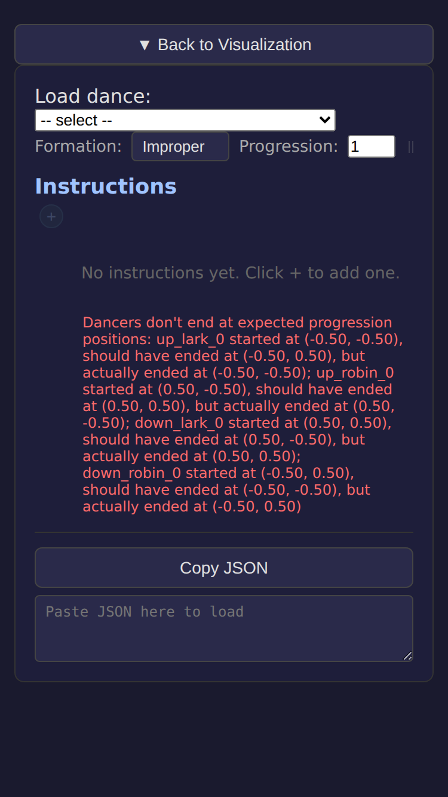
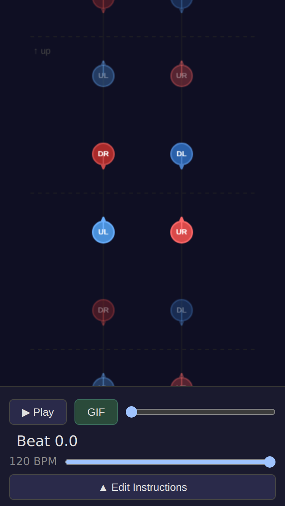

# Mobile: two-mode layout (compact controls vs full-screen editor)

*2026-02-22T20:09:37Z by Showboat 0.6.0*
<!-- showboat-id: f5b0a64c-4cf1-4925-9246-0ea05e5863ce -->

Replaced the old overlay drawer with two mutually exclusive mobile modes: a compact controls bar (play, scrubber, BPM, GIF export, Edit Instructions button) and a full-screen instruction editor. Step buttons and the lark/robin/up/down legend are removed from mobile.

## Compact controls mode

```bash {image}
demos/fix-drawer-zindex/screenshot-1.png
```


## Full-screen instruction editor (after tapping Edit Instructions)

```bash {image}
demos/fix-drawer-zindex/screenshot-2.png
```



## Back to visualization (after tapping Back to Visualization)

```bash {image}
demos/fix-drawer-zindex/screenshot-3.png
```



```bash
npx vitest run 2>&1 | tail -8
```

```output
 ✓ src/figures/longWaves/longWaves.test.ts (3 tests) 9ms
 ✓ src/SearchableDropdown.test.tsx (24 tests) 978ms

 Test Files  21 passed (21)
      Tests  189 passed (189)
   Start at  20:10:19
   Duration  8.72s (transform 7.01s, setup 0ms, import 18.27s, tests 1.36s, environment 5.45s)

```

```bash
npx tsc --noEmit 2>&1 | tail -3
```

```output
```
