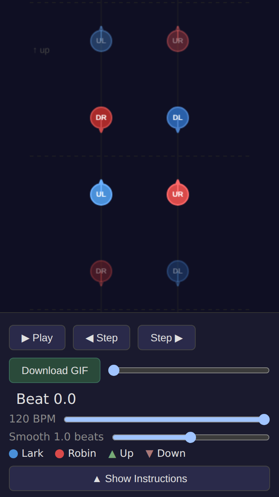
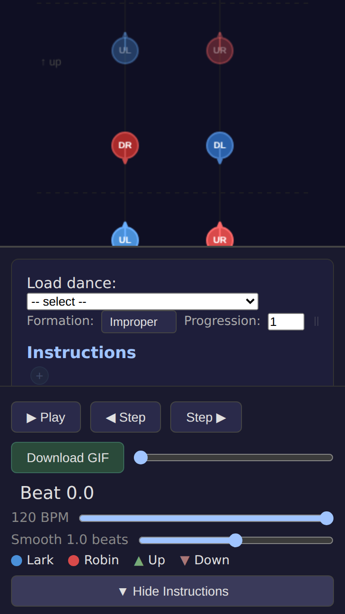
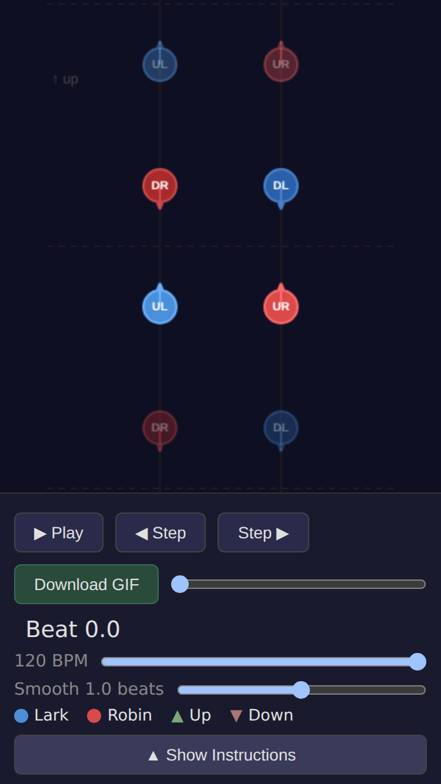

# Fix: Mobile instruction drawer no longer blocks Hide button

*2026-02-22T20:00:19Z by Showboat 0.6.0*
<!-- showboat-id: e4d8ea9e-268d-4770-a26e-80da253680b7 -->

On mobile, the instruction drawer (position: fixed, z-index: 10) was stacking on top of the mobile controls when opened, making the Hide Instructions toggle button unclickable. Fixed by giving .mobile-controls position: relative and z-index: 20 so it stays above the drawer.

## Step 1: Mobile view — controls and Show Instructions button visible

```bash {image}
demos/fix-drawer-zindex/screenshot-1.png
```



## Step 2: Drawer open — instructions visible, Hide button still clickable

```bash {image}
demos/fix-drawer-zindex/screenshot-2.png
```



## Step 3: After clicking Hide — drawer closes successfully

```bash {image}
demos/fix-drawer-zindex/screenshot-3.png
```



```bash
npx vitest run 2>&1 | tail -8
```

```output
 ✓ src/figures/circle/circle.test.ts (5 tests) 11ms
 ✓ src/SearchableDropdown.test.tsx (24 tests) 903ms

 Test Files  21 passed (21)
      Tests  189 passed (189)
   Start at  20:01:19
   Duration  7.07s (transform 5.73s, setup 0ms, import 14.69s, tests 1.23s, environment 4.46s)

```

```bash
npx tsc --noEmit 2>&1 | tail -3
```

```output
```
