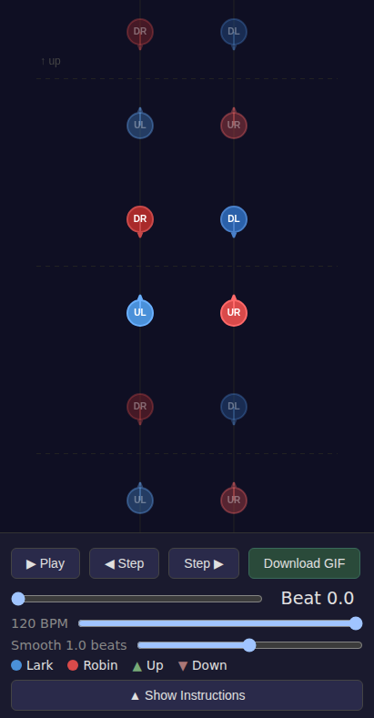
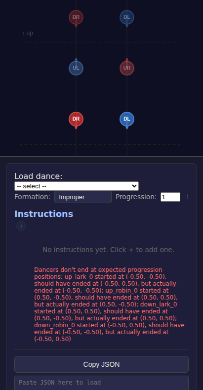

# Fix Mobile UI Layout

*2026-02-22T04:02:31Z by Showboat 0.6.0*
<!-- showboat-id: 6520138f-b321-4c42-9ff2-447cbf37f8cb -->

On mobile viewports (411×789), the playback controls were clipped off the bottom of the screen by the canvas, and the 'Show Instructions' button was inaccessible. This fix adds `flex-shrink: 0` to `.mobile-controls` and `overflow: hidden` to `.vis-column` on mobile, ensuring controls always remain visible and the instruction drawer can be opened.

## Drawer Closed (411×789)

Controls are fully visible at the bottom of the viewport. Play/Step/GIF buttons, scrubber, BPM, smoothness slider, legend, and the 'Show Instructions' toggle are all accessible.

```bash {image}
demos/fix-mobile-layout/mobile-drawer-closed.png
```



## Drawer Open (411×789)

Tapping 'Show Instructions' opens the instruction drawer as a bottom sheet (max 60vh). The dance loader, formation selector, instruction list, and JSON import/export are all accessible.

```bash {image}
demos/fix-mobile-layout/mobile-drawer-open.png
```



```bash
npx vitest run 2>&1 | tail -8
```

```output
 ✓ src/figures/longWaves/longWaves.test.ts (3 tests) 7ms
 ✓ src/SearchableDropdown.test.tsx (24 tests) 799ms

 Test Files  21 passed (21)
      Tests  189 passed (189)
   Start at  04:03:31
   Duration  5.62s (transform 5.02s, setup 0ms, import 11.36s, tests 1.06s, environment 3.52s)

```

```bash
npx tsc --noEmit 2>&1 | tail -3
```

```output
```
