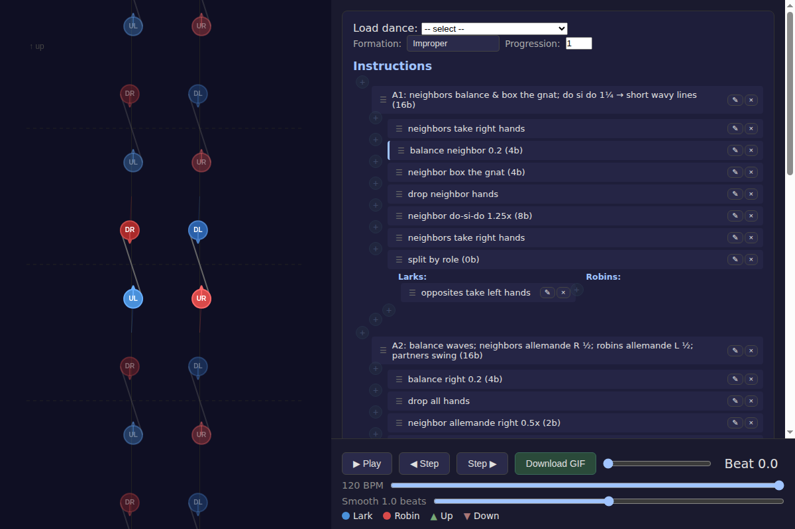
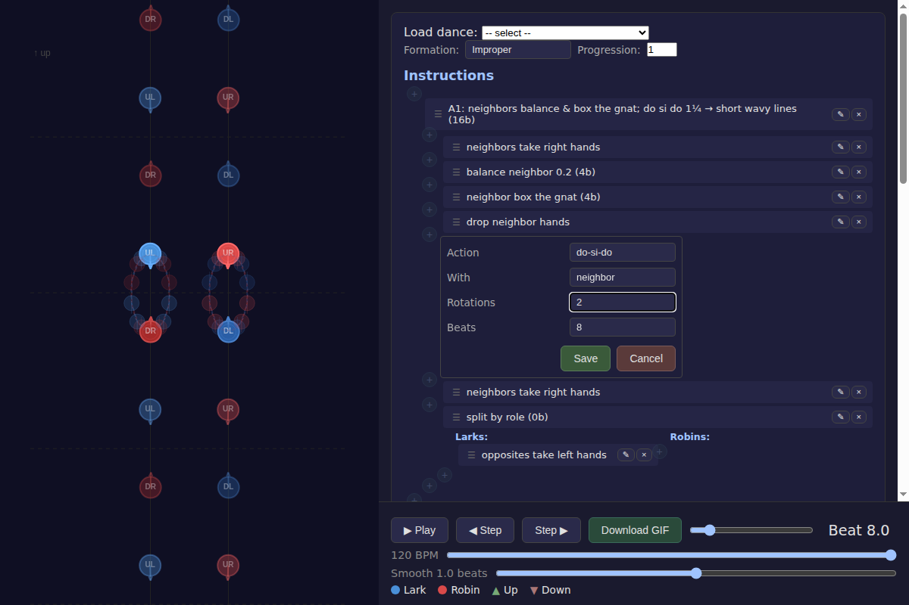
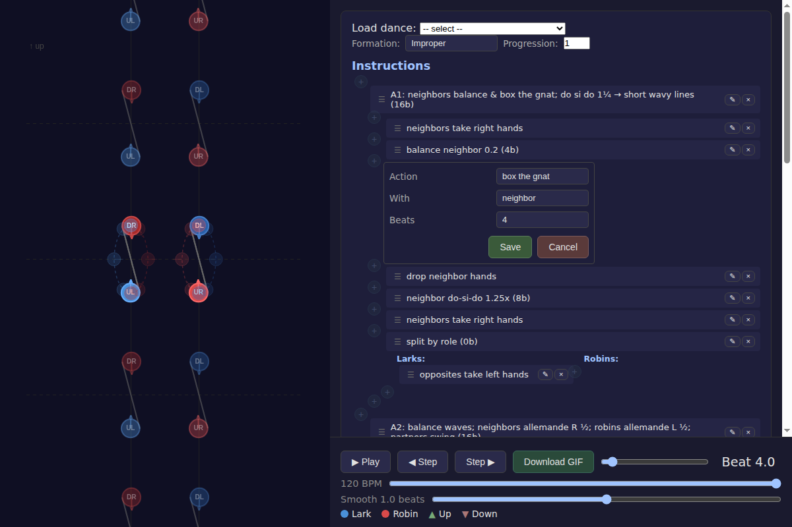

# Keyframe Preview During Instruction Editing

*2026-02-19T20:56:48Z by Showboat 0.6.0*
<!-- showboat-id: 6c9e31ee-18f1-46cf-9c2b-68b22188d88c -->

This demo shows the new keyframe preview feature. When adding or editing a dance instruction, playback pauses at the instruction's start beat, and ghostly dancer positions trace out the instruction's movement path.

## Step 1: Load an Example Dance

We load the 'Otter's Allemande' example dance, which populates the instruction list and starts the visualization at beat 0.

```bash {image}
02-dance-loaded.png
```



## Step 2: Click Edit on an Instruction

Clicking the edit pencil icon on the 'neighbor do-si-do 1.25x (8b)' instruction causes:
1. **Playback pauses** immediately
2. **Beat jumps** to the instruction's start beat (Beat 8.0)
3. **Ghost preview** appears showing the do-si-do orbit paths

The dashed lines trace each dancer's path through the figure. Small ghost circles mark dancer positions at whole-beat intervals.

```bash {image}
03-editing-dosido.png
```


## Step 3: Live Preview Updates on Field Change

Changing the 'Rotations' field from 1.25 to 2 immediately updates the ghost preview. The orbits become wider, showing a full two-rotation do-si-do path. The preview updates in real-time as the form parses correctly.

```bash {image}
04-modified-rotations.png
```



## Step 4: Editing a Different Instruction (Box the Gnat)

Editing the 'box the gnat' instruction jumps to Beat 4.0 and shows the characteristic crossing elliptical paths where neighbors trade places. Each dancer's path shows as a dashed line with ghost circles at beat intervals.

```bash {image}
06-editing-boxthegnat.png
```



## Implementation Summary

The keyframe preview feature adds three behaviors:

1. **Pause on edit/add**: When an instruction's edit form opens (or a new instruction form appears), playback pauses and the beat scrubs to the instruction's start position.

2. **Live keyframe generation**: As form fields change and parse into a valid instruction, keyframe generation runs on the current form state using the starting keyframe and dancer scope for that position in the instruction tree.

3. **Ghost rendering**: The preview keyframes are drawn as transparent overlays on the canvas — dashed path lines connecting adjacent positions for each dancer, and small ghost dancer circles at whole-beat intervals.
