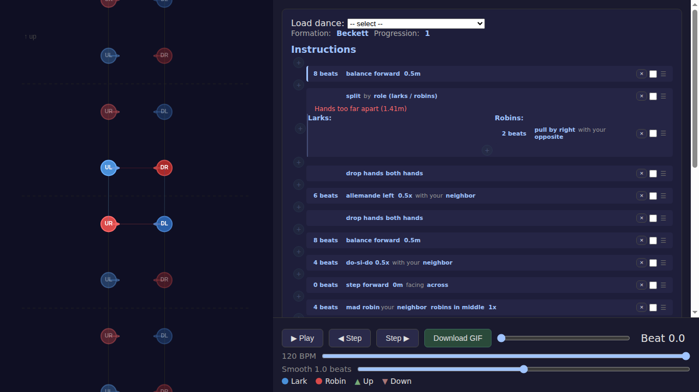
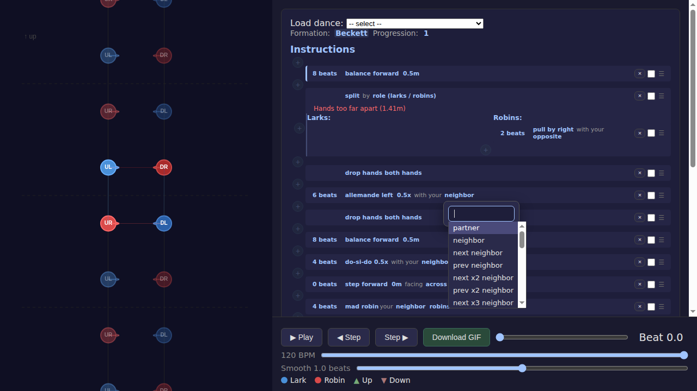
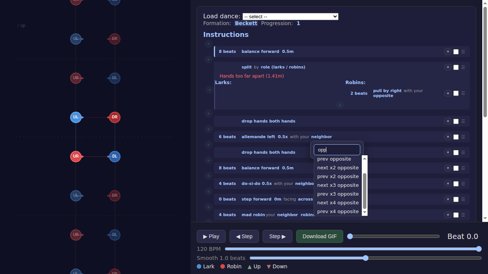

# Limit Relationship Selector to ±4

*2026-02-23T06:44:05Z by Showboat 0.6.0*
<!-- showboat-id: a3cdd27a-da55-4b0d-9080-e2a418172575 -->

The relationship selector dropdown previously offered offsets up to ±8. This change limits it to ±4, which is more practical for real contra dances. 'Opposite' relationships (opposite, opposite ±1/2/3/4) continue to appear for applicable figures.

## Step 1: Load a dance with relationship fields

```bash {image}
demos/limit-relationship-options/screenshot-2.png
```



## Step 2: Open a relationship selector dropdown
Clicking a relationship field (e.g. 'neighbor' on the allemande) opens the searchable dropdown. Options now go up to ±4 (not ±8), and include opposite, opposite ±1/2/3/4.

```bash {image}
demos/limit-relationship-options/screenshot-3.png
```



## Step 3: Bottom of the dropdown
Scrolling to the bottom confirms the list ends at shadow ±4 (previously went to ±8).

```bash {image}
demos/limit-relationship-options/screenshot-4.png
```


## Step 4: Filtering for 'opp' shows all opposite options
Typing 'opp' in the search filters to just the opposite variants: opposite, next/prev opposite, next/prev x2/x3/x4 opposite.

```bash {image}
demos/limit-relationship-options/screenshot-5.png
```


## Step 5: Opposite options end at ±4
Scrolling to the bottom confirms the list ends at 'prev x4 opposite' — no x5 through x8.

```bash {image}
demos/limit-relationship-options/screenshot-6.png
```



```bash
npx vitest run 2>&1 | tail -8
```

```output
 ✓ src/figures/longWaves/longWaves.test.ts (3 tests) 8ms
 ✓ src/SearchableDropdown.test.tsx (24 tests) 843ms

 Test Files  20 passed (20)
      Tests  180 passed (180)
   Start at  06:50:27
   Duration  5.71s (transform 4.73s, setup 0ms, import 10.60s, tests 1.14s, environment 3.56s)

```
