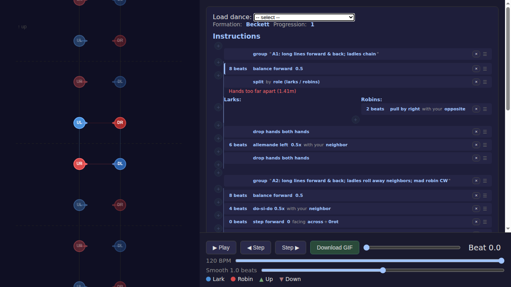
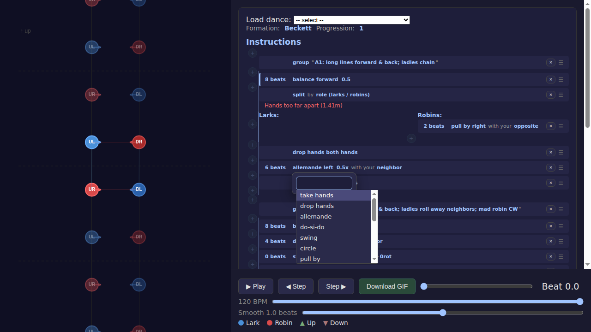

# Popover Inputs & Flat Nesting

*2026-02-22T21:04:24Z by Showboat 0.6.0*
<!-- showboat-id: 26130cea-9b9a-47e0-b94d-8d798ac4c18f -->

This PR redesigns the instruction construction UI to reduce clutter. Values now display as bold colored inline text instead of always-visible input fields. Clicking a value opens a popover with the input control. Number values support drag-to-change directly on the text. Groups and splits use a border-left indicator instead of indentation, keeping all instructions at the same horizontal alignment.

## Instruction list with inline values

Instructions now display as readable sentences with bold blue values (e.g. **balance forward 0.5**). All instructions are at the same horizontal position regardless of nesting depth. Groups and splits are indicated by a subtle left border line.

```bash {image}
demos/popover-inputs/overview.png
```



## Popover editing

Clicking any value opens a popover with the appropriate input control. Here, clicking **neighbor** opens a searchable dropdown with all relationship options (partner, neighbor, opposite, etc.). The popover auto-focuses the search input.

```bash {image}
demos/popover-inputs/popover-dropdown.png
```


## Number input popover

Clicking a number value (like **8 beats**) opens a focused number input popover. The number text itself also serves as a drag-to-change handle -- dragging left/right adjusts the value without opening the popover.

```bash {image}
demos/popover-inputs/popover-number.png
```


## Action type popover

The action type (e.g. **allemande**) also uses the popover pattern. Clicking it opens a searchable dropdown with all available figure types. The search input supports type-ahead filtering.

```bash {image}
demos/popover-inputs/popover-action.png
```



## Verification

```bash
npx vitest run 2>&1 | tail -8
```

```output
 ✓ src/figures/longWaves/longWaves.test.ts (3 tests) 8ms
 ✓ src/SearchableDropdown.test.tsx (24 tests) 857ms

 Test Files  21 passed (21)
      Tests  189 passed (189)
   Start at  21:07:43
   Duration  5.86s (transform 5.38s, setup 0ms, import 11.68s, tests 1.18s, environment 3.68s)

```

```bash
npx tsc --noEmit 2>&1 | tail -3
```

```output
```
