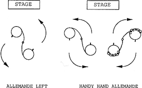

# Allemande

*From "Contra Dance Choreography" by Mary McNab Dart, Appendix B*

**Allemande left (right):** Two dancers take left (right) hands and walk around one another, pulling slightly on one another's arms to facilitate the turn. The grip is not the one we use to shake hands, but is a grip with the thumb pointing upward, with which it is possible to exert tension more effectively. "Once around" means that the dancers walk completely around one another and back to where they started. Fractional turns are measured in relation to this. A *handy hand* allemande means that as one couple goes between the other, they allemande with the nearest hand, the dancers on one side of the set using the opposite hand from the dancers on the other side of the set.

