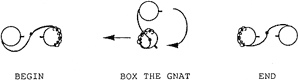

# Box the Gnat

*From "Contra Dance Choreography" by Mary McNab Dart, Appendix B*

**Box the gnat:** This is a figure borrowed from western square dance, and is a means by which two dancers change places. The two dancers face one another and take right hands; the woman turns and backs under the man's right arm while the man crosses to her place, turning to face back the way he came; the dancers end the move each occupying the original place of the other.

