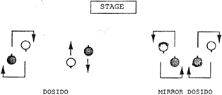

# Do Si Do

*From "Contra Dance Choreography" by Mary McNab Dart, Appendix B*

**Dosido:** The basic dosido figure is executed by two dancers who pass right shoulders with one another, pass back to back, and back up passing left shoulders and returning to place. A mirror dosido is one in which the dancers on one side of the set begin the dosido passing right shoulders, and the dancers on the other side of the set begin the dosido passing left shoulders. In modern contra dance choreography it is common to do a "dosido once and a half," which means that the dancers complete the basic dosido figure and then pass right shoulders again, moving past one another, often to swing someone else. Many of today's contra dancers like to twirl themselves around as they do the dosido.

